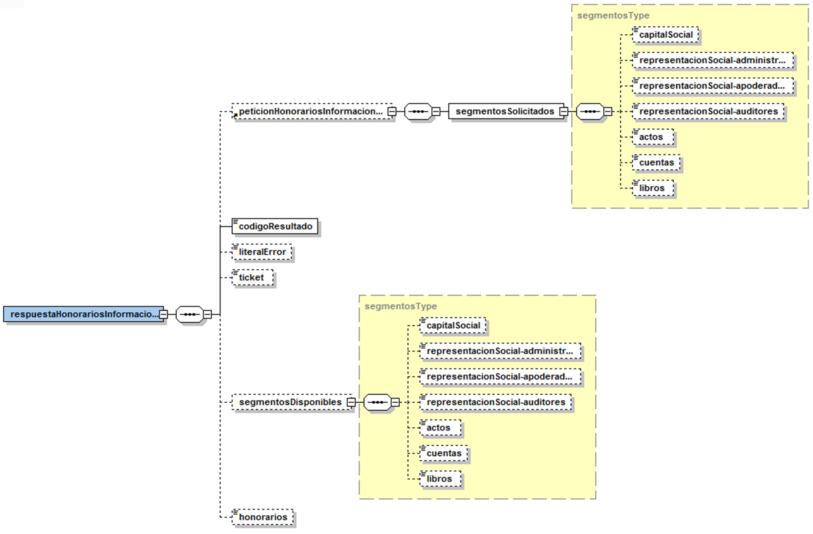
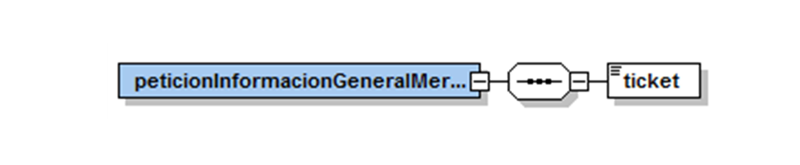
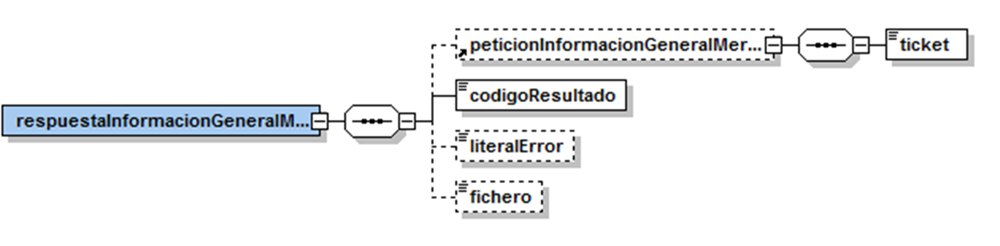

# VO-CORPME-REGISTRE_MERCANTIL Document d&#39;integració del servei

## **Via Oberta – Registre Mercantil**


**Històric de revisions**

| **Versió** | **Data** | **Autor** | **Comentaris** |
| --- | --- | --- | --- |
| V1.0 | 21/05/2009 | Roger Noguera Arnau | Creació del document |
| V1.1 | 19/10/2009 | Roger Noguera Arnau | Ampliació d&#39;informació dels honoraris |


# 1 Introducció

Aquest document detalla la missatgeria associada al servei del Registre Mercantil.

Per poder realitzar la integració cal conèixer prèviament la següent documentació:

- Document del Servei Via Oberta.
- [Document de Missatgeria Genèrica de la PCI del Consorci AOC.][PCI]

[PCI]:https://github.com/ConsorciAOC/PCI

# 2 Transmissions de dades disponibles

Les dades disponibles a través del servei són les que es presenten a continuació:

| **EMISSOR** |
| --- |
| CORPME (Colegio de Registradores de la Propiedad y Mercantiles de España) |

| **PRODUCTE** | **MODALITAT** | **DESCRIPCIO** |
| --- | --- | --- |
| **REGISTRE\_MERCANTIL** | INFO\_MERCANTIL | Nota mercantil.|


# 3 Missatgeria dels serveis

A continuació es detalla la missatgeria corresponent de les modalitats de consum del producte REGISTRE\_MERCANTIL.

## 3.1 Nota informativa mercantil (INFO\_MERCANTIL)

Per restriccions imposades pel servei de l&#39;emissor final, l&#39;obtenció de la informació mercantil d&#39;una determinada denominació social s&#39;ha de realitzar en dues fases:

- Una primera fase on el requeridor indica la informació que desitja consultar. En aquest cas el servei respon indicant quina de la informació desitjada està disponible i els honoraris de la informació.
- En la segona fase, i un cop consultada la informació disponible i els honoraris de la mateixa, el requeridor sol·licita la informació mercantil.

---
 Per restriccions de l&#39;emisor final, entre una crida de consulta d&#39;informació disponible / honoraris i la crida de consulta d&#39;informació mercantil no poden transcòrrer més de 15 minuts.
 En resum: l&#39;emisor final no retornarà la nota informativa mercantil si no es consulta prèviament la informació disponible i els honoraris.

---

### 3.1.1 Fase 1: consulta d&#39;informació disponible i honoraris

#### 3.1.1.1 Petició

Per tal d&#39;obtenir la informació mercantil disponible d&#39;una determinada denominació social, cal informar les següents dades en el bloc de dades genèriques de la petició:

| _Element_ | _Descripció_ |
| --- | --- |
| /Peticion/Atributos/IdSolicitanteOriginal | Identificador del requeridor emprat als efectes de facturació de consum del servei. |
| //DatosGenericos/Titular/TipoDocumentacion | Tipus de documentació: CIF |
| //DatosGenericos/Titular/Documentacion | Documentació de la denominació social.|

Addicionalment, en el missatge específic de la petició cal indicar aquella informació mercantil que es desitja consultar:

| _Element_ | _Descripció_ |
| --- | --- |
| peticionHonorariosInformacionGeneralMercantil/segmentosSolicitados/capitalSocial | Capital social. L&#39;existència de l&#39;element indica que es vol consultar aquesta informació. |
| peticionHonorariosInformacionGeneralMercantil/segmentosSolicitados/representacionSocial-administradores | Representació social. Administradors. L&#39;existència de l&#39;element indica que es vol consultar aquesta informació. |
| peticionHonorariosInformacionGeneralMercantil/segmentosSolicitados/representacionSocial-apoderados | Representació social. Apoderats. L&#39;existència de l&#39;element indica que es vol consultar aquesta informació. |
| peticionHonorariosInformacionGeneralMercantil/segmentosSolicitados/representacionSocial-auditores | Representació social. Auditors. L&#39;existència de l&#39;element indica que es vol consultar aquesta informació. |
| peticionHonorariosInformacionGeneralMercantil/segmentosSolicitados/actos | Relació d&#39;actes inscrits publicats en el BORME. L&#39;existència de l&#39;element indica que es vol consultar aquesta informació. |
| peticionHonorariosInformacionGeneralMercantil/segmentosSolicitados/cuentas | Relació de comptes dipositades. L&#39;existència de l&#39;element indica que es vol consultar aquesta informació. |
| peticionHonorariosInformacionGeneralMercantil/segmentosSolicitados/libros | Llibres legalitzats. L&#39;existència de l&#39;element indica que es vol consultar aquesta informació. |


---
 Les dades identificatives d&#39;una denominació social existent sempre es retornen en la nota mercantil. Per aquest motiu no cal explicitar que es desitja consultar-les en els segments sol·licitats.

---

#### 3.1.1.2 Resposta

| _Element_ | _Descripció_ |
| --- | --- |
| respuestaHonorariosInformacionGeneralMercantil/peticionHonorariosInformacionGeneralMercantil | Petició (vegeu apartat anterior). |
| respuestaHonorariosInformacionGeneralMercantil/codigoResultado | 0: OK, 1: error realizant la consulta.|
| respuestaHonorariosInformacionGeneralMercantil/literalError | Text informatiu en cas d&#39;error. |
| respuestaHonorariosInformacionGeneralMercantil/ticket | Ticket associat a la consulta d&#39;honoraris. |
| respuestaHonorariosInformacionGeneralMercantil/segmentosDisponibles/capitalSocial | Capital social. L&#39;existència de l&#39;element indica que l&#39;informació està disponible. |
| respuestaHonorariosInformacionGeneralMercantil/segmentosDisponibles/representacionSocial-administradores | Representació social. Administradors. L&#39;existència de l&#39;element indica que l&#39;informació està disponible. |
| respuestaHonorariosInformacionGeneralMercantil/segmentosDisponibles/representacionSocial-apoderados | Representació social. Apoderats. L&#39;existència de l&#39;element indica que l&#39;informació està disponible. |
| respuestaHonorariosInformacionGeneralMercantil/segmentosDisponibles/representacionSocial-auditores | Representació social. Auditors. L&#39;existència de l&#39;element indica que l&#39;informació està disponible. |
| respuestaHonorariosInformacionGeneralMercantil/segmentosDisponibles/actos | Relació d&#39;actes inscrits publicats en el BORME. L&#39;existència de l&#39;element indica que l&#39;informació està disponible. |
| respuestaHonorariosInformacionGeneralMercantil/segmentosDisponibles/cuentas | Relació de comptes dipositades. L&#39;existència de l&#39;element indica que l&#39;informació està disponible. |
| respuestaHonorariosInformacionGeneralMercantil/segmentosDisponibles/libros | Llibres legalitzats. L&#39;existència de l&#39;element indica que l&#39;informació està disponible. |
| respuestaHonorariosInformacionGeneralMercantil/honorarios | Honoraris¹ de les dades sol·licitades disponibles (ja inclouen el 50% de reducció segons conveni AOC). |
```
¹ Les tarifes dels honoraris del CORPME es poden consultar a la següent URL: https://www.registradores.org/mercantil/jsp/menu/icara.jsp. A aquests imports cal aplicar-hi el 50% de reducció segons conveni.
```


### 3.1.2 Fase 2: consulta d&#39;informació mercantil

---
 Per aquesta consulta es recomana establir un _timeout_ ampli (fins a 1 minut) degut a que la generació de respostes per part del CORPME pot ser costosa en alguns casos.

---

 En aquells casos on el CORPME facturi consultes que per motius tècnics no hagin arribat al destinatari y es requereixi un abonament, el CORPME posa a disposició dels requeridors aquestes dades de contacte: 902 734 375 / [soporte@registradores.org](mailto:soporte@registradores.org).

---

#### 3.1.2.1 Petició

Per tal d&#39;obtenir la informació mercantil d&#39;una determinada denominació social, cal informar les següents dades en el bloc de dades genèriques de la petició:

| _Element_ | _Descripció_ |
| --- | --- |
| /Peticion/Atributos/IdSolicitanteOriginal | Identificador del requeridor emprat als efectes de facturació de consum del servei. |
| //DatosGenericos/Titular/TipoDocumentacion | Tipus de documentació: CIF |
| //DatosGenericos/Titular/Documentacion | Documentació de la denominació social. |

Addicionalment, en el missatge específic de la petició cal indicar el tiquet obtingut prèviament en la consulta d&#39;honoraris:

| _Element_ | _Descripció_ |
| --- | --- |
| peticionInformacionGeneralMercantil/ticket | Tiquet associat a la consulta d&#39;honoraris realitzada prèviament. |



#### 3.1.2.2 Resposta

| _Element_ | _Descripció_ |
| --- | --- |
| respuestaInformacionGeneralMercantil/peticionInformacionGeneralMercantil | Petició (vegeu apartat anterior). |
| respuestaInformacionGeneralMercantil/codigoResultado | 0: OK, 1: error realizant la consulta. |
| respuestaInformacionGeneralMercantil/literalError | Text informatiu en cas d&#39;error. |
| respuestaInformacionGeneralMercantil/fichero | Fitxer PDF en format Base64 amb la informació mercantil sol·licitada. |



# 4 Joc de proves

El següent CIF de proves proporcionat pel CORPME aplica a l&#39;entorn de pre-producció.

| _CIF_ | _Dades disponibles_ |
| --- | --- |
| B83378026 | <li> Capital social. <li> Representació social. Administradors.<li> Relació d&#39;actes inscrits publicats en el BORME.<li> Relació de comptes dipositades.<li> Llibres legalitzats. |


# Annex – exemple de missatges 

## Consulta d&#39;honoraris

__Exemple petició__
```
<Peticion xmlns="http://gencat.net/scsp/esquemes/peticion">
	<Atributos>
		<IdPeticion>CORPME_HONORARIS</IdPeticion>
		<NumElementos>1</NumElementos>
		<TimeStamp>2007-04-18 17:35:02.454</TimeStamp>
		<CodigoCertificado>INFO_MERCANTIL</CodigoCertificado>
		<CodigoProducto>REGISTRE_MERCANTIL</CodigoProducto>
		<DatosAutorizacion>
			<IdentificadorSolicitante>CAOC</IdentificadorSolicitante>
			<NombreSolicitante>CAOC</NombreSolicitante>
			<Finalidad>FINALITAT</Finalidad>
		</DatosAutorizacion>
		<Emisor>
			<NifEmisor>Q0801175A</NifEmisor>
			<NombreEmisor>CAOC</NombreEmisor>
		</Emisor>
		<IdSolicitanteOriginal>CAOC</IdSolicitanteOriginal>
		<NomSolicitanteOriginal>CAOC</NomSolicitanteOriginal>
		<Funcionario>
			<NombreCompletoFuncionario>FUNCIONARIO</NombreCompletoFuncionario>
			<NifFuncionario>NIF</NifFuncionario>
			<EMailFuncionario/>
		</Funcionario>
	</Atributos>
	<Solicitudes>
		<SolicitudTransmision>
			<DatosGenericos>
				<Emisor>
					<NifEmisor>Q0801175A</NifEmisor>
					<NombreEmisor>CAOC</NombreEmisor>
				</Emisor>
				<Solicitante>
					<IdentificadorSolicitante>CAOC</IdentificadorSolicitante>
					<NombreSolicitante>CAOC</NombreSolicitante>
					<Finalidad>FINALITAT</Finalidad>
					<Consentimiento>Si</Consentimiento>
					<Funcionario>
						<NombreCompletoFuncionario>FUNCIONARIO</NombreCompletoFuncionario>
						<NifFuncionario>NIF</NifFuncionario>
						<EMailFuncionario/>
					</Funcionario>
				</Solicitante>
				<Titular>
					<TipoDocumentacion>CIF</TipoDocumentacion>
					<Documentacion>B83378026</Documentacion>
					<NombreCompleto/>
				</Titular>
				<Transmision>
					<CodigoCertificado>INFO_MERCANTIL</CodigoCertificado>
					<IdSolicitud>1</IdSolicitud>
					<IdTransmision>EXPEDIENT</IdTransmision>
					<FechaGeneracion>18042007</FechaGeneracion>
				</Transmision>
			</DatosGenericos>
			<DatosEspecificos>
				<reg:peticionHonorariosInformacionGeneralMercantil
                 xmlns:reg="http://www.aocat.net/registradors">
					<reg:segmentosSolicitados>
						<reg:capitalSocial/>
						<reg:representacionSocial-administradores/>
						<reg:representacionSocial-apoderados/>
						<reg:representacionSocial-auditores/>
						<reg:actos/>
						<reg:cuentas/>
						<reg:libros/>
					</reg:segmentosSolicitados>
				</reg:peticionHonorariosInformacionGeneralMercantil>
			</DatosEspecificos>
		</SolicitudTransmision>
	</Solicitudes>
</Peticion>	

```


__Exemple resposta__

```
<res:Respuesta xmlns:res="http://gencat.net/scsp/esquemes/respuesta">
	<res:Atributos>
		<res:CodigoCertificado>INFO_MERCANTIL</res:CodigoCertificado>
		<res:CodigoProducto>REGISTRE_MERCANTIL</res:CodigoProducto>
		<res:IdPeticion>CORPME_HONORARIS</res:IdPeticion>
		<res:IdSolicitanteOriginal>CAOC</res:IdSolicitanteOriginal>
		<res:NomSolicitanteOriginal>CAOC</res:NomSolicitanteOriginal>
		<res:NumElementos>1</res:NumElementos>
		<res:TimeStamp>2009-05-21T13:41:25.756+02:00</res:TimeStamp>
		<res:Emisor>
			<res:NifEmisor>Q0801175A</res:NifEmisor>
			<res:NombreEmisor>CAOC</res:NombreEmisor>
		</res:Emisor>
		<res:Estado>
			<res:CodigoEstado>0003</res:CodigoEstado>
			<res:CodigoEstadoSecundario/>
			<res:LiteralError>OK</res:LiteralError>
			<res:TiempoEstimadoRespuesta>0</res:TiempoEstimadoRespuesta>
		</res:Estado>
		<res:Funcionario>
			<res:NombreCompletoFuncionario>FUNCIONARIO</res:NombreCompletoFuncionario>
			<res:NifFuncionario>NIF</res:NifFuncionario>
			<res:EMailFuncionario/>
			<res:CertificadoDigital/>
		</res:Funcionario>
	</res:Atributos>
	<res:Transmisiones>
		<res:TransmisionDatos>
			<res:DatosGenericos>
				<res:Emisor>
					<res:NombreEmisor>CAOC</res:NombreEmisor>
					<res:NifEmisor>Q0801175A</res:NifEmisor>
				</res:Emisor>
				<res:Solicitante>
					<res:IdentificadorSolicitante>CAOC</res:IdentificadorSolicitante>
					<res:NombreSolicitante>CAOC</res:NombreSolicitante>
					<res:Finalidad>FINALITAT</res:Finalidad>
					<res:Consentimiento>Si</res:Consentimiento>
					<res:Funcionario>
						<res:NombreCompletoFuncionario>FUNCIONARIO</res:NombreCompletoFuncionario>
						<res:NifFuncionario>NIF</res:NifFuncionario>
						<res:EMailFuncionario/>
						<res:CertificadoDigital/>
					</res:Funcionario>
				</res:Solicitante>
				<res:Titular>
					<res:TipoDocumentacion>CIF</res:TipoDocumentacion>
					<res:Documentacion>B83378026</res:Documentacion>
					<res:NombreCompleto/>
					<res:Nombre/>
					<res:Apellido1/>
					<res:Apellido2/>
				</res:Titular>
				<res:Transmision>
					<res:CodigoCertificado>INFO_MERCANTIL</res:CodigoCertificado>
					<res:FechaGeneracion>18042007</res:FechaGeneracion>
					<res:IdSolicitud>1</res:IdSolicitud>
					<res:IdTransmision>EXPEDIENT</res:IdTransmision>
				</res:Transmision>
			</res:DatosGenericos>
			<res:DatosEspecificos>
				<reg:respuestaHonorariosInformacionGeneralMercantil
                    xmlns:reg="http://www.aocat.net/registradors">
					<reg:peticionHonorariosInformacionGeneralMercantil>
						<reg:segmentosSolicitados>
							<reg:capitalSocial/>
							<reg:representacionSocial-administradores/>
							<reg:representacionSocial-apoderados/>
							<reg:representacionSocial-auditores/>
							<reg:actos/>
							<reg:cuentas/>
							<reg:libros/>
						</reg:segmentosSolicitados>
					</reg:peticionHonorariosInformacionGeneralMercantil>
					<reg:codigoResultado>0</reg:codigoResultado>
					<reg:ticket>Q09SU18xODE1NDk5MDYzOTkyMjSE9OT1JBUklTXzE=</reg:ticket>
					<reg:segmentosDisponibles>
						<reg:capitalSocial/>
						<reg:representacionSocial-administradores/>
						<reg:actos/>
						<reg:cuentas/>
						<reg:libros/>
					</reg:segmentosDisponibles>
					<reg:honorarios>5.98</reg:honorarios>
				</reg:respuestaHonorariosInformacionGeneralMercantil>
			</res:DatosEspecificos>
		</res:TransmisionDatos>
	</res:Transmisiones>
</res:Respuesta>	

```

## Consulta d&#39;informació

__Exemple petició__

```
<Peticion xmlns="http://gencat.net/scsp/esquemes/peticion">
	<Atributos>
		<IdPeticion>CORPME_INFO</IdPeticion>
		<NumElementos>1</NumElementos>
		<TimeStamp>2007-04-18 17:35:02.454</TimeStamp>
		<CodigoCertificado>INFO_MERCANTIL</CodigoCertificado>
		<CodigoProducto>REGISTRE_MERCANTIL</CodigoProducto>
		<DatosAutorizacion>
			<IdentificadorSolicitante>CAOC</IdentificadorSolicitante>
			<NombreSolicitante>CAOC</NombreSolicitante>
			<Finalidad>FINALITAT</Finalidad>
		</DatosAutorizacion>
		<Emisor>
			<NifEmisor>Q0801175A</NifEmisor>
			<NombreEmisor>CAOC</NombreEmisor>
		</Emisor>
		<IdSolicitanteOriginal>CAOC</IdSolicitanteOriginal>
		<NomSolicitanteOriginal>CAOC</NomSolicitanteOriginal>
		<Funcionario>
			<NombreCompletoFuncionario>FUNCIONARIO</NombreCompletoFuncionario>
			<NifFuncionario>NIF</NifFuncionario>
			<EMailFuncionario/>
		</Funcionario>
	</Atributos>
	<Solicitudes>
		<SolicitudTransmision>
			<DatosGenericos>
				<Emisor>
					<NifEmisor>Q0801175A</NifEmisor>
					<NombreEmisor>CAOC</NombreEmisor>
				</Emisor>
				<Solicitante>
					<IdentificadorSolicitante>CAOC</IdentificadorSolicitante>
					<NombreSolicitante>CAOC</NombreSolicitante>
					<Finalidad>FINALITAT</Finalidad>
					<Consentimiento>Si</Consentimiento>
					<Funcionario>
						<NombreCompletoFuncionario>FUNCIONARIO</NombreCompletoFuncionario>
						<NifFuncionario>NIF</NifFuncionario>
						<EMailFuncionario/>
					</Funcionario>
				</Solicitante>
				<Titular>
					<TipoDocumentacion>CIF</TipoDocumentacion>
					<Documentacion>B83378026</Documentacion>
					<NombreCompleto/>
				</Titular>
				<Transmision>
					<CodigoCertificado>INFO_MERCANTIL</CodigoCertificado>
					<IdSolicitud>1</IdSolicitud>
					<IdTransmision>EXPEDIENT</IdTransmision>
					<FechaGeneracion>18042007</FechaGeneracion>
				</Transmision>
			</DatosGenericos>
			<DatosEspecificos>
				<reg:peticionInformacionGeneralMercantil 
                  xmlns:reg="http://www.aocat.net/registradors">
					<reg:ticket>Q09SU18xODE1NDk5MDYzOTkyMjSE9OT1JBUklTXzE=</reg:ticket>
				</reg:peticionInformacionGeneralMercantil>				
			</DatosEspecificos>
		</SolicitudTransmision>
	</Solicitudes>
</Peticion>	

```

__Exemple resposta__

```
<res:Respuesta xmlns:res="http://gencat.net/scsp/esquemes/respuesta">
	<res:Atributos>
		<res:CodigoCertificado>INFO_MERCANTIL</res:CodigoCertificado>
		<res:CodigoProducto>REGISTRE_MERCANTIL</res:CodigoProducto>
		<res:IdPeticion>CORPME_INFO</res:IdPeticion>
		<res:IdSolicitanteOriginal>CAOC</res:IdSolicitanteOriginal>
		<res:NomSolicitanteOriginal>CAOC</res:NomSolicitanteOriginal>
		<res:NumElementos>1</res:NumElementos>
		<res:TimeStamp>2009-05-21T13:44:29.153+02:00</res:TimeStamp>
		<res:Emisor>
			<res:NifEmisor>Q0801175A</res:NifEmisor>
			<res:NombreEmisor>CAOC</res:NombreEmisor>
		</res:Emisor>
		<res:Estado>
			<res:CodigoEstado>0003</res:CodigoEstado>
			<res:CodigoEstadoSecundario/>
			<res:LiteralError>OK</res:LiteralError>
			<res:TiempoEstimadoRespuesta>0</res:TiempoEstimadoRespuesta>
		</res:Estado>
		<res:Funcionario>
			<res:NombreCompletoFuncionario>FUNCIONARIO</res:NombreCompletoFuncionario>
			<res:NifFuncionario>NIF</res:NifFuncionario>
			<res:EMailFuncionario/>
			<res:CertificadoDigital/>
		</res:Funcionario>
	</res:Atributos>
	<res:Transmisiones>
		<res:TransmisionDatos>
			<res:DatosGenericos>
				<res:Emisor>
					<res:NombreEmisor>CAOC</res:NombreEmisor>
					<res:NifEmisor>Q0801175A</res:NifEmisor>
				</res:Emisor>
				<res:Solicitante>
					<res:IdentificadorSolicitante>CAOC</res:IdentificadorSolicitante>
					<res:NombreSolicitante>CAOC</res:NombreSolicitante>
					<res:Finalidad>FINALITAT</res:Finalidad>
					<res:Consentimiento>Si</res:Consentimiento>
					<res:Funcionario>
						<res:NombreCompletoFuncionario>FUNCIONARIO</res:NombreCompletoFuncionario>
						<res:NifFuncionario>NIF</res:NifFuncionario>
						<res:EMailFuncionario/>
						<res:CertificadoDigital/>
					</res:Funcionario>
				</res:Solicitante>
				<res:Titular>
					<res:TipoDocumentacion>CIF</res:TipoDocumentacion>
					<res:Documentacion>B83378026</res:Documentacion>
					<res:NombreCompleto/>
					<res:Nombre/>
					<res:Apellido1/>
					<res:Apellido2/>
				</res:Titular>
				<res:Transmision>
					<res:CodigoCertificado>INFO_MERCANTIL</res:CodigoCertificado>
					<res:FechaGeneracion>18042007</res:FechaGeneracion>
					<res:IdSolicitud>1</res:IdSolicitud>
					<res:IdTransmision>EXPEDIENT</res:IdTransmision>
				</res:Transmision>
			</res:DatosGenericos>
			<res:DatosEspecificos>
				<reg:respuestaInformacionGeneralMercantil              
                     xmlns:reg="http://www.aocat.net/registradors">
					<reg:peticionInformacionGeneralMercantil>
						<reg:ticket>Q09SU18xODE1NDk5MDYzOTkyMjSE9OT1JBUklTXzE=</reg:ticket>
					</reg:peticionInformacionGeneralMercantil>
					<reg:codigoResultado>0</reg:codigoResultado>
					<reg:fichero>JVBERi0xLjQKJcfwMDAwIG4gCjAwMDAwMjc3MDkgMDuZm8gNTg
                     MCBSCi9Sb290IDU3IDAgUgovU2l6ZSA1OQovSUQgWzwzMDc2OGFiMjJhZmU0Y2Ez
                     (...)
                     MzZmODBhZjA0ZGI3OTIxZj48MzA3NjhhYjIyYWZlNGNhMzM2ZjgwYWYwNGRiNz
                    kyMWY+XQo+PgpzdGFydHhyZWYKMzA1MjcKJSVFT0YK</reg:fichero>
				</reg:respuestaInformacionGeneralMercantil>
			</res:DatosEspecificos>
		</res:TransmisionDatos>
	</res:Transmisiones>
</res:Respuesta>	

```